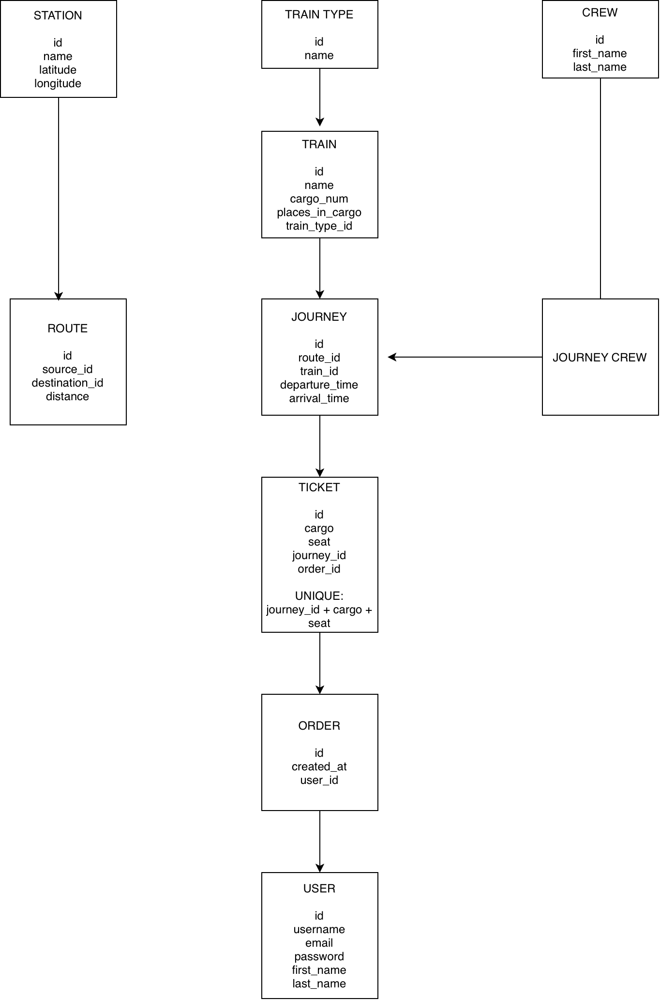
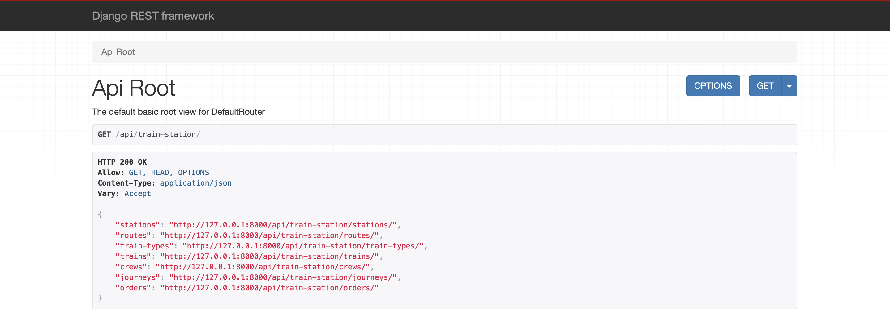
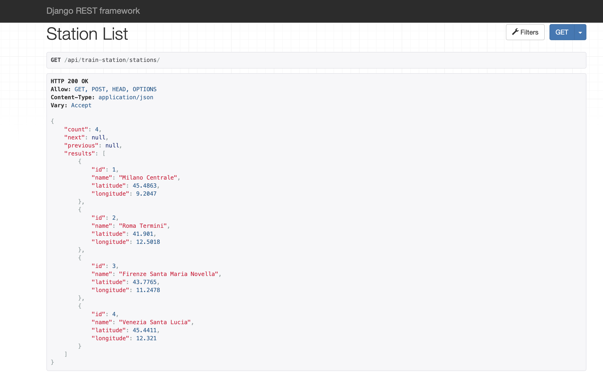
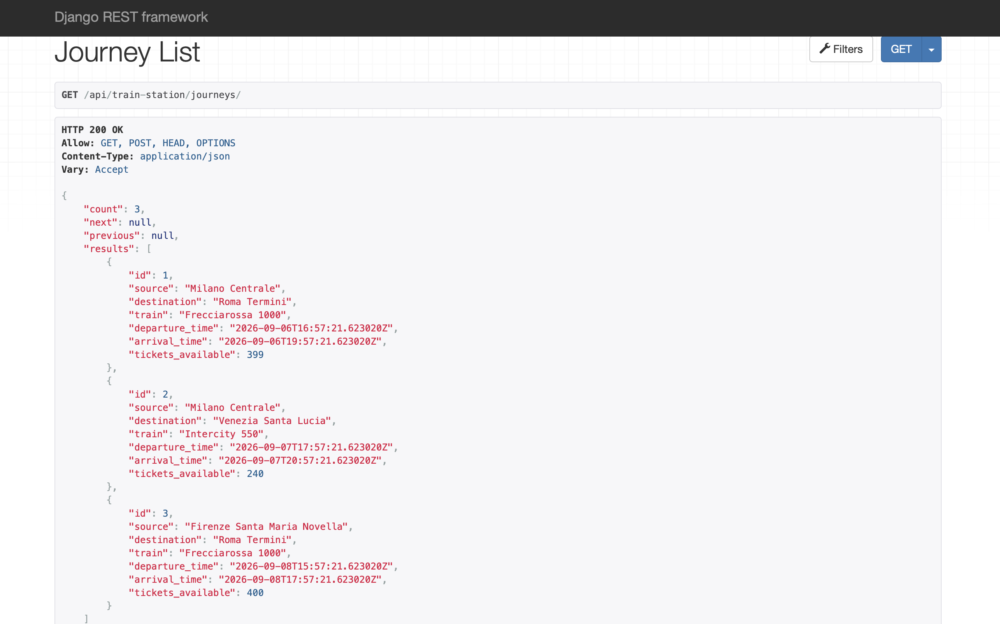
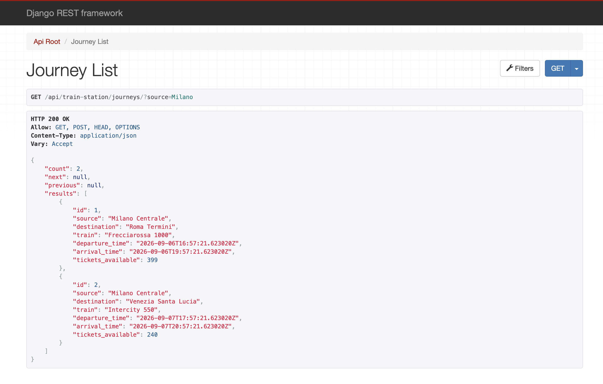
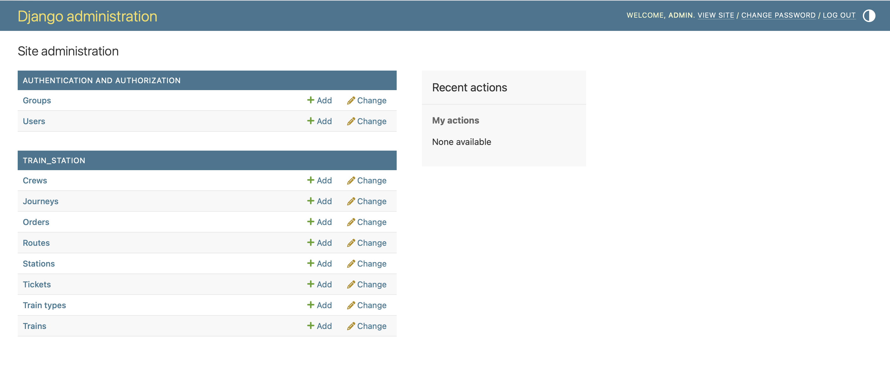

# Train Station API

Train Station API is a RESTful web service built with Django and Django REST Framework for managing train stations, routes, trains, journeys, crews, ticket orders, and seat reservations.

This project was developed as a portfolio project inspired by the Cinema Shop API architecture and extended with custom booking validation, filtering, searching, pagination, JWT authentication, demo data, automated tests, and database documentation.

## Features

- User registration
- JWT authentication
- Access token refresh
- User profile management
- Train station management
- Route management
- Train type management
- Train management
- Crew management
- Journey management
- Ticket reservation
- Order management
- Seat availability validation
- Duplicate seat booking prevention
- Search
- Filtering
- Ordering
- Pagination
- Django Admin
- Demo data command
- Automated API tests
- Database diagram
- Browsable API screenshots

## Tech Stack

- Python
- Django
- Django REST Framework
- Simple JWT
- django-filter
- SQLite
- Flake8
- Git
- GitHub
- draw.io

## Database Structure

The project contains the following main entities:

- User
- Station
- Route
- TrainType
- Train
- Crew
- Journey
- Order
- Ticket

Main relationships:

- A Route has a source Station and a destination Station.
- A Train belongs to a TrainType.
- A Journey uses one Route and one Train.
- A Journey can have multiple Crew members.
- A Crew member can participate in multiple Journeys.
- An Order belongs to a User.
- An Order contains one or more Tickets.
- A Ticket belongs to one Journey and one Order.
- The same cargo and seat cannot be booked twice for the same Journey.

## Database Diagram

The following diagram represents the main database structure and relationships used by the Train Station API.



The editable draw.io source is also included in the repository:

```text
docs/database-diagram.drawio


## Screenshots

### API Root



### Stations List



### Journeys List



### Journey Filtering



### Django Admin


